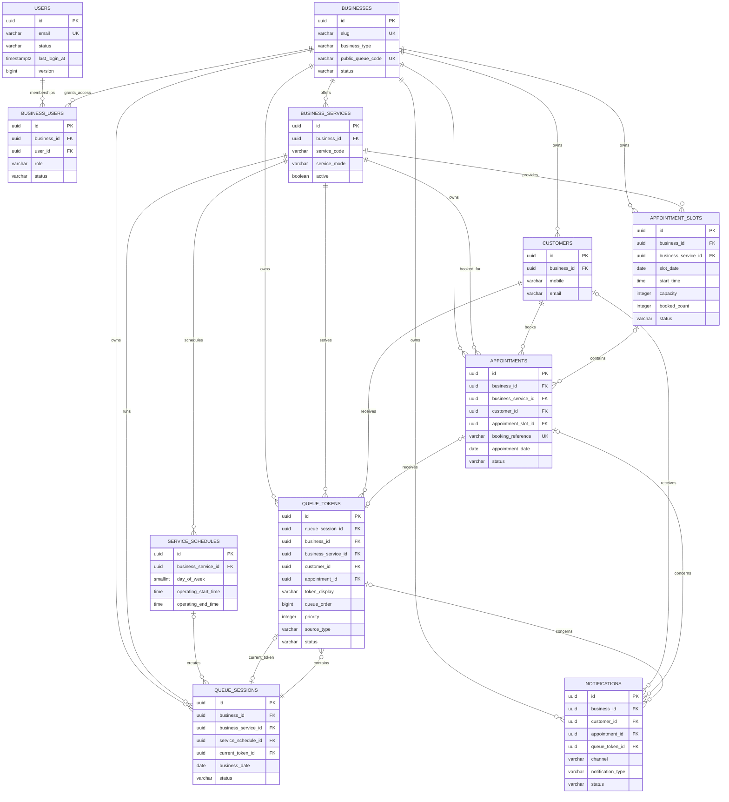

# Syntagi Lite ER diagram

```mermaid
erDiagram
    USERS {
        uuid id PK
        varchar email UK
        varchar status
        timestamptz last_login_at
        bigint version
    }

    BUSINESSES {
        uuid id PK
        varchar slug UK
        varchar business_type
        varchar public_queue_code UK
        varchar status
    }

    BUSINESS_USERS {
        uuid id PK
        uuid business_id FK
        uuid user_id FK
        varchar role
        varchar status
    }

    CUSTOMERS {
        uuid id PK
        uuid business_id FK
        varchar mobile
        varchar email
    }

    BUSINESS_SERVICES {
        uuid id PK
        uuid business_id FK
        varchar service_code
        varchar service_mode
        boolean active
    }

    SERVICE_SCHEDULES {
        uuid id PK
        uuid business_service_id FK
        smallint day_of_week
        time operating_start_time
        time operating_end_time
    }

    APPOINTMENT_SLOTS {
        uuid id PK
        uuid business_id FK
        uuid business_service_id FK
        date slot_date
        time start_time
        integer capacity
        integer booked_count
        varchar status
    }

    APPOINTMENTS {
        uuid id PK
        uuid business_id FK
        uuid business_service_id FK
        uuid customer_id FK
        uuid appointment_slot_id FK
        varchar booking_reference UK
        date appointment_date
        varchar status
    }

    QUEUE_SESSIONS {
        uuid id PK
        uuid business_id FK
        uuid business_service_id FK
        uuid service_schedule_id FK
        uuid current_token_id FK
        date business_date
        varchar status
    }

    QUEUE_TOKENS {
        uuid id PK
        uuid queue_session_id FK
        uuid business_id FK
        uuid business_service_id FK
        uuid customer_id FK
        uuid appointment_id FK
        varchar token_display
        bigint queue_order
        integer priority
        varchar source_type
        varchar status
    }

    NOTIFICATIONS {
        uuid id PK
        uuid business_id FK
        uuid customer_id FK
        uuid appointment_id FK
        uuid queue_token_id FK
        varchar channel
        varchar notification_type
        varchar status
    }

    USERS ||--o{ BUSINESS_USERS : memberships
    BUSINESSES ||--o{ BUSINESS_USERS : grants_access
    BUSINESSES ||--o{ CUSTOMERS : owns
    BUSINESSES ||--o{ BUSINESS_SERVICES : offers
    BUSINESS_SERVICES ||--o{ SERVICE_SCHEDULES : schedules
    BUSINESSES ||--o{ APPOINTMENT_SLOTS : owns
    BUSINESS_SERVICES ||--o{ APPOINTMENT_SLOTS : provides
    BUSINESSES ||--o{ APPOINTMENTS : owns
    BUSINESS_SERVICES ||--o{ APPOINTMENTS : booked_for
    CUSTOMERS ||--o{ APPOINTMENTS : books
    APPOINTMENT_SLOTS o|--o{ APPOINTMENTS : contains
    BUSINESSES ||--o{ QUEUE_SESSIONS : owns
    BUSINESS_SERVICES ||--o{ QUEUE_SESSIONS : runs
    SERVICE_SCHEDULES o|--o{ QUEUE_SESSIONS : creates
    QUEUE_SESSIONS ||--o{ QUEUE_TOKENS : contains
    QUEUE_TOKENS o|--o| QUEUE_SESSIONS : current_token
    BUSINESSES ||--o{ QUEUE_TOKENS : owns
    BUSINESS_SERVICES ||--o{ QUEUE_TOKENS : serves
    CUSTOMERS ||--o{ QUEUE_TOKENS : receives
    APPOINTMENTS o|--o| QUEUE_TOKENS : receives
    BUSINESSES ||--o{ NOTIFICATIONS : owns
    CUSTOMERS o|--o{ NOTIFICATIONS : receives
    APPOINTMENTS o|--o{ NOTIFICATIONS : concerns
    QUEUE_TOKENS o|--o{ NOTIFICATIONS : concerns
```
